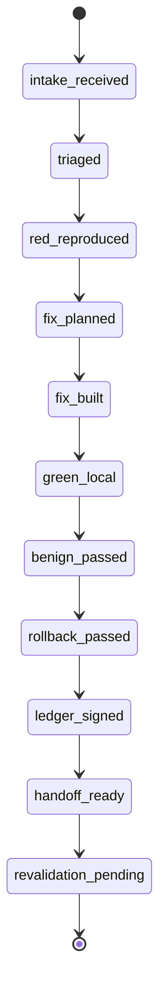

# PURGATORIUM — CANON ROADMAP

**Arquivo:** `purgatorium_roadmapcanon.md`  
**Versão:** v1.0 — pós-Infernus IF-11  
**Gerado em:** 2026-06-08 America/Sao_Paulo  
**Status deste documento:** `OPERATOR_APPROVED_CANONROADMAP_FOR_PURGATORIUM_FULL`  
**Autoridade de live-state:** `ACTIVE_CONTEXT_STATE.json` continua vencendo este documento.  
**Autoridade de rota macro:** `ROADMAP_CANONICAL.md` continua vencendo este documento.  
**Execução real autorizada por este documento:** `false`.  
**Produto / Piloto / Bedrock / real_apply / secrets / runtime real autorizados por este documento:** `false`.

---

## 0. Cláusula de autoridade

Este arquivo consolida a versão canônica do roadmap do **Purgatorium** depois do fechamento do Infernus IF-11 e substitui o `infernus_full_canonroadmap.md` como documento de direção técnica ativa pós-Infernus.

Ele é o documento de direção técnica ativa do Purgatorium, mas não altera sozinho a rota viva: não autoriza execução real, não substitui `ACTIVE_CONTEXT_STATE.json`, não substitui a Transition Table de `ROADMAP_CANONICAL.md` e não fecha finding.

Para virar rota operacional executável e válida no active-context, precisa existir:

1. entrada explícita na Transition Table;
2. active-context remoto sincronizado;
3. validator pass;
4. artifacts nomeados no disco;
5. CI terminal green;
6. decisão do operador quando a rota exigir `operator`.

Regra de conflito:

```text
ACTIVE_CONTEXT_STATE.json > ARIS_BOOT.md > ROADMAP_CANONICAL.md > DECISION_LOCKS.md > este arquivo > rascunhos antigos > memória/chat.
```

---

## 0.1 Supersession do Infernus canonroadmap

A partir da aprovação operacional deste documento, o `infernus_full_canonroadmap.md` deixa de ser o documento de direção ativa pós-Infernus.

Classificação obrigatória do Infernus canonroadmap:

```yaml
path_anterior_ativo: project_mirror/docs/infernus_full/infernus_full_canonroadmap.md
classification_after_supersession: excluded_from_context
read_by_default: false
authority: none
use: forensic_only
superseded_by: project_mirror/docs/purgatorium_full/purgatorium_roadmapcanon.md
physical_delete_allowed: false_without_archive_artifact
```

Essa supersession não apaga histórico e não invalida os fatos produzidos pelo Infernus. Ela apenas impede que o roadmap do Infernus continue sendo lido como autoridade de direção depois do IF-11.

---

## 1. Resultado da pesquisa e correção do rascunho antigo

### 1.1 O que o rascunho dizia antes

O rascunho original tratava Purgatorium como `RASCUNHO / DESIGN NOTES`, não canônico, não executável e dependente de IF-08, IF-09 e IF-10 ainda terminarem.

A estrutura rascunhada era:

```text
PURG-00
  ↓
PURG-S0
  ↓
PURG-S1
  ↓
PURG-S2
  ↓
PURG-S3
  ↓
PURG-RES
  ↓
PURG-EXIT
  ↓
INF-REVALIDATION
```

A doutrina correta já estava boa:

```text
Purgatorium corrige.
Purgatorium prova localmente.
Purgatorium empacota evidência.
Purgatorium entrega para Infernus Revalidation.
Purgatorium não fecha finding.
```

### 1.2 O que mudou depois do Infernus

O rascunho antigo precisa ser atualizado porque o Infernus já avançou além do ponto em que ele estava.

Fatos incorporados agora:

```yaml
latest_completed_phase: IF-11 Minos Final Verdict + Closure
latest_completed_status: if11_minos_final_verdict_closure_pass
infernus_closure_status: closed_with_purgatorium_handoff_ready
purgatorium_handoff_ready: true
operator_cosignature_status: pending_operator_review
bedrock_ready: false
product_ready: false
real_execution_authorized: false
runtime_executed: false
real_apply_executed: false
product_bedrock_real_apply_secrets_executed: false
external_network_used_except_github_governance: false
```

Conclusão:

```text
Purgatorium não é mais “plano no vazio” nem rascunho externo.
Purgatorium agora é um roadmap condicionado ao handoff real do Infernus:
- IF09-FIND-001 entra como finding validado obrigatório;
- IF09-FIND-002 permanece contextual/candidato;
- IF09-FIND-003 permanece inválido/excluído;
- IF09-OBS-001 entra apenas como observação de suporte;
- IF09-REPRO-001, IF09-REPLAY-001 e IF09-MUT-001 são referências mínimas para reprodução/replay/mutation.
```

### 1.3 Correções obrigatórias em relação ao rascunho

| Item | Antes | Agora |
|---|---|---|
| Status | Design notes | Canonroadmap aprovado pelo operador para materialização operacional |
| Gatilho | Depois de IF-08/IF-09/IF-10 | IF-09/IF-10/IF-11 já existem como pacotes sincronizados |
| Escopo inicial | Findings futuros genéricos | Handoff validado `IF09-FIND-001` |
| Candidate findings | Não definido | `IF09-FIND-002` não pode ser promovido sem evidência nova |
| Invalid findings | Não definido | `IF09-FIND-003` não pode receber remediation track |
| Closure | Purgatorium não fecha | Mantido e reforçado |
| Revalidation | Próxima camada | Mantido; só Infernus Revalidation declara estado final |
| Bedrock/produto | Fechados | Continuam fechados |
| Runtime/real_apply | Fechados | Continuam fechados |
| Operador | Não detalhado | Cosignature ainda `pending_operator_review` |

---

## 2. Source ledger usado para esta versão

### 2.1 Active-context e rota canônica

```yaml
ACTIVE_CONTEXT_STATE.json:
  blob_sha: 2744e2da8f4f894d6b0193186ed404d747699d32
  phase_id: INF-FULL-07
  latest_completed_phase: IF-11 Minos Final Verdict + Closure
  latest_completed_status: if11_minos_final_verdict_closure_pass
  active_next_phase: IF-08
  latest_completed_next_recommended_step: prepare_purgatorium_handoff_or_operator_review

ROADMAP_CANONICAL.md:
  blob_sha_at_source_read: 8a264b625374dd445f0cba99c73ebfc29f7f50c6
  chain:
    - Infernus revela.
    - Purgatorium corrige.
    - Infernus revalida.
    - BenchUIX valida produto real.
    - Crisol refina.
    - Bedrock decide.

DECISION_LOCKS.md:
  blob_sha: eb2efa1ce7127707c4d33948eddc04f9a20be5ca
  latest_lock: IF-11 Minos Final Verdict + Closure Lock
```

### 2.2 Infernus execution facts incorporados

```yaml
IF-08 W0.5:
  status: if08_w05_controlled_ledger_evidence_integrity_execution_pass
  tamper_attempts_expected: 4
  tamper_attempts_detected: 4
  TER: 1.0

IF-08 W1:
  status: if08_w1_context_memory_rag_controlled_execution_pass
  context_integrity_violations_expected: 10
  context_integrity_violations_blocked: 10
  CIR: 1.0

IF-08 W2:
  status: if08_w2_auth_hitl_identity_exfil_controlled_execution_pass
  attack_attempts_expected: 12
  attack_attempts_blocked: 12
  FAR: 0
  CTL: 0

IF-08 W3:
  status: if08_w3_runtime_tool_mcp_sandbox_controlled_execution_pass
  attack_attempts_expected: 13
  attack_attempts_blocked: 13
  SER: 0
  RCA: 1.0
  sandbox_escape_attempt_count: 3
  sandbox_escape_count: 0
  sirene_status: conditional_or_deferred_with_reason

IF-08 W4:
  status: if08_w4_replay_rollback_concurrency_cost_controlled_execution_pass
  synthetic_attack_cases_total: 14
  synthetic_attack_cases_blocked_or_detected: 14
  rollback_honesty_checks: 6/6
  duplicate_detection_checks: 5/5
  cost_enforcement_checks: 3/3
  RHR: 1.0
  DDR: 1.0
  CER: 1.0

IF-08 W5:
  status: if08_w5_business_chaos_controlled_execution_pass
  executor_bot_count: 14
  synthetic_domain_count: 7
  critical_coverage_cells_total: 12
  critical_coverage_cells_passed: 12
  critical_coverage_completion: 1.0
  business_scenarios_total: 14
  business_scenarios_blocked_or_detected: 14
  sirene_oracle_mode: synthetic_transcript_only

IF-08 W6:
  status: if08_w6_final_audit_controlled_execution_pass
  TTR: 0
  HAR: 1.0
  minos_mechanical_readiness: true
  minos_semantic_readiness: true
  anti_theater_review_passed: true
```

### 2.3 Handoff pós-Infernus

```yaml
IF-09 Evidence Bundle + Vulnerability Register:
  status: if09_evidence_bundle_vulnerability_register_pass
  root_manifest_sha256: 3f750d814afbd4465a3abf4ee5a18ca563980619b887f0ad074ed2f8c1108660
  evidence_bundle_v4_materialized: true
  vulnerability_register_v4_materialized: true
  validated_findings_total: 1
  finding_candidates_total: 1
  invalid_findings_total: 1
  observations_total: 1
  reproduction_units_total: 1
  replay_units_total: 2
  mutation_units_total: 2
  evidence_units_total: 7
  purgatorium_handoff_required_ids:
    - IF09-FIND-001

IF-10 Purgatorium Handoff Graph:
  status: if10_purgatorium_handoff_graph_pass
  graph_sha256: c786d5ba366a64c1ebf69daf7586721cfc8cddee9c4c54235f1f14c644292dd1
  validated_handoff_ids:
    - IF09-FIND-001
  contextual_candidate_ids:
    - IF09-FIND-002
  excluded_invalid_ids:
    - IF09-FIND-003
  supporting_observation_ids:
    - IF09-OBS-001
  node_count: 9
  edge_count: 8
  duplicate_node_ids: []
  duplicate_edge_ids: []
  dangling_edges: []
  handoff_ids_missing_tracks: []
  invalid_findings_with_remediation: []
  candidate_findings_promoted_without_evidence: []

IF-11 Minos Final Verdict + Closure:
  status: if11_minos_final_verdict_closure_pass
  minos_mechanical_verdict: pass
  minos_semantic_verdict: pass
  anti_theater_verdict: pass
  operator_cosignature_status: pending_operator_review
  infernus_closure_status: closed_with_purgatorium_handoff_ready
  purgatorium_handoff_ready: true
```

---

## 3. Doutrina do Purgatorium

### 3.1 Função

Purgatorium é a camada de **remediação controlada** entre Infernus e Infernus Revalidation.

Ele existe para:

1. receber findings validados pelo Infernus;
2. organizar dependências;
3. reproduzir falhas;
4. propor correções;
5. aplicar correções em escopo controlado;
6. provar regressão vermelho → verde;
7. provar benign flow;
8. provar rollback e kill-switch;
9. assinar/registrar evidência;
10. entregar pacote para Infernus Revalidation.

Ele não existe para:

1. declarar finding fechado;
2. declarar produto pronto;
3. declarar Bedrock pronto;
4. aceitar risco como resolvido;
5. transformar candidato em finding sem evidência;
6. corrigir invalid finding;
7. abrir runtime real;
8. tocar secrets;
9. executar real_apply;
10. promover piloto/produto.

### 3.2 Frase operacional

```text
Infernus revela.
Purgatorium corrige.
Infernus revalida.
```

Purgatorium não é tribunal final. É oficina com evidência.

---

## 4. Escopo inicial do Purgatorium pós-IF11

### 4.1 Escopo permitido

```yaml
allowed_initial_scope:
  - preparar intake do IF10 handoff graph
  - materializar backlog do IF09-FIND-001
  - validar que IF09-FIND-002 continua candidate/contextual
  - validar que IF09-FIND-003 continua excluded/invalid
  - importar IF09-OBS-001 como supporting observation
  - criar dependency DAG
  - criar severity matrix somente a partir do handoff real
  - criar plano de reprodução RED para IF09-FIND-001
  - criar proof loop por finding
  - criar residual register
  - criar exit manifest para Infernus Revalidation
```

### 4.2 Escopo proibido

```yaml
forbidden_initial_scope:
  - declarar IF09-FIND-001 closed
  - promover IF09-FIND-002 sem nova evidência primária
  - abrir remediation track para IF09-FIND-003
  - usar observação como finding
  - abrir produto
  - abrir Bedrock
  - abrir piloto
  - executar runtime real
  - real_apply
  - secrets
  - external network fora de GitHub governance
  - dependency/package-manager mutation
  - MCP real
  - RAG ingestion real
  - memory write real
```

### 4.3 Lacuna crítica

O active-context confirma os IDs, hashes e integridade do handoff, mas não expõe neste repositório o conteúdo completo do grafo `purgatorium_handoff_graph_v4.json` com severidade, camada afetada, arquivos afetados, bot/oracle e root cause detalhados.

Portanto:

```text
Purgatorium pode preparar o roadmap.
Purgatorium não pode escolher S0/S1/S2/S3 para IF09-FIND-001 sem ler o grafo real.
Se o grafo real não estiver acessível no início do PURG-00, o resultado correto é DATA_GAP_BLOCKED, não inferência.
```

---

## 5. Roadmap macro atualizado

### 5.1 Sequência macro

```text
PURG-PRE  — Canonical Authority Materialization & Route Opening
  ↓
PURG-00   — Handoff Intake & Authority Lock
  ↓
PURG-01   — Triage, Severity Matrix & Dependency DAG
  ↓
PURG-02   — Reproduction / RED Baseline
  ↓
PURG-03   — Remediation Plan Compiler
  ↓
PURG-Sx   — Conditional Severity Tracks
  ↓
PURG-04   — Universal Proof Loop
  ↓
PURG-05   — Evidence Ledger, Signing & Custody
  ↓
PURG-RES  — Residual Risk & Carry-Forward
  ↓
PURG-EXIT — Revalidation Handoff Package
  ↓
INF-REVALIDATION — Independent closure/reopen decision
```

### 5.2 Diferença importante em relação ao rascunho

`PURG-S0`, `PURG-S1`, `PURG-S2` e `PURG-S3` **não** devem ser uma fila obrigatória sempre executada.

Eles são **tracks condicionais por finding**, derivados da severidade e da camada afetada. A sequência obrigatória é intake → triage → RED → plan → track(s) → proof loop → ledger → residual/exit.

---

## 6. Fases detalhadas

## PURG-PRE — Canonical Authority Materialization & Route Opening

```yaml
phase_id: PURG-PRE
type: REVIEW
live_route_mutation: possible_only_with_operator
runtime_allowed: false
real_apply_allowed: false
bedrock_allowed: false
product_allowed: false
```

### Objetivo

Materializar este canonroadmap aprovado pelo operador como autoridade técnica ativa do Purgatorium, mover o Infernus canonroadmap para excludent/historical, e abrir rota operacional somente por Transition Table válida.

### Inputs

```text
ACTIVE_CONTEXT_STATE.json
ARIS_BOOT.md
ROADMAP_CANONICAL.md
DECISION_LOCKS.md
purgatorium_roadmapcanon.md
IF09 evidence bundle/root manifest
IF10 purgatorium handoff graph
IF11 closure packet
```

### Outputs

```text
artifacts/purgatorium/purg_pre_canonical_authority_materialization_decision.json
docs/purgatorium/purgatorium_roadmapcanon.md
```

### Gate de saída

```yaml
pass_if:
  operator_approval_status: approved_by_operator_chat_2026_06_08
  transition_table_candidate_created: true
  execution_locks_preserved: true
  no_real_surface_authorized: true
blocked_if:
  operator_approval_missing: true
  active_context_drift: true
  IF10_graph_unavailable: true
```

---

## PURG-00 — Handoff Intake & Authority Lock

```yaml
phase_id: PURG-00
type: INTAKE
purpose: importar o handoff sem corrigir nada
runtime_allowed: false
real_apply_allowed: false
```

### Objetivo

Validar o pacote recebido do Infernus e impedir que Purgatorium comece com input contaminado.

### Tarefas

1. Ler `ACTIVE_CONTEXT_STATE.json`.
2. Confirmar `latest_completed_phase=IF-11 Minos Final Verdict + Closure`.
3. Confirmar `purgatorium_handoff_ready=true`.
4. Confirmar `operator_cosignature_status=pending_operator_review` e carregar isso como warning.
5. Confirmar `IF09-FIND-001` como único finding validado obrigatório.
6. Confirmar `IF09-FIND-002` como candidate/contextual.
7. Confirmar `IF09-FIND-003` como invalid/excluded.
8. Confirmar `IF09-OBS-001` como supporting observation.
9. Confirmar `graph_sha256` e `root_manifest_sha256`.
10. Confirmar que nenhum real execution lock foi invertido.

### Outputs

```text
artifacts/purgatorium/purg00_intake_decision.json
artifacts/purgatorium/purg00_authority_lock.json
artifacts/purgatorium/purg00_source_packet_index.json
artifacts/purgatorium/purg00_handoff_id_classification.json
artifacts/purgatorium/purg00_no_real_execution_attestation.json
```

### Schema mínimo

```json
{
  "phase_id": "PURG-00",
  "decision": "pass|blocked|invalid",
  "source_root_manifest_sha256": "...",
  "source_graph_sha256": "...",
  "validated_handoff_ids": ["IF09-FIND-001"],
  "contextual_candidate_ids": ["IF09-FIND-002"],
  "excluded_invalid_ids": ["IF09-FIND-003"],
  "supporting_observation_ids": ["IF09-OBS-001"],
  "operator_cosignature_status": "pending_operator_review",
  "real_execution_authorized": false,
  "runtime_executed": false,
  "real_apply_executed": false
}
```

### Blockers

```text
source_root_manifest_sha mismatch
source_graph_sha mismatch
candidate promoted without evidence
invalid finding has remediation track
dangling handoff edge
missing reproduction unit
missing replay unit
missing mutation unit
runtime lock inverted
active-context drift
```

---

## PURG-01 — Triage, Severity Matrix & Dependency DAG

```yaml
phase_id: PURG-01
type: PLANNING
purpose: classificar findings e ordenar correções
runtime_allowed: false
real_apply_allowed: false
```

### Objetivo

Converter `IF09-FIND-001` em backlog controlado com severidade, dependências e rota de correção.

### Inputs obrigatórios por finding

```yaml
finding_id:
severity:
affected_layer:
affected_files:
source_bot:
source_wave:
oracle_id:
root_cause_candidate:
blast_radius:
target_control:
reproduction_unit:
replay_units:
mutation_units:
risk_class:
dependency_group:
parallelization_mode:
```

### Modos de paralelização

```yaml
sequential_required:
  reason: mesmo arquivo, mesmo módulo, mesmo controle, mesmo stateful fixture, ou dependência causal direta

parallel_isolated_allowed:
  reason: findings independentes, worktrees isoladas, artifacts independentes, sem shared control

batch_required:
  reason: múltiplos findings são sintomas do mesmo root cause

blocked_by_dependency:
  reason: precisa de correção anterior ou artifact ausente
```

### Outputs

```text
artifacts/purgatorium/purg01_backlog.json
artifacts/purgatorium/purg01_severity_matrix.json
artifacts/purgatorium/purg01_control_target_map.json
artifacts/purgatorium/purg01_dependency_dag.json
artifacts/purgatorium/purg01_execution_plan.json
artifacts/purgatorium/purg01_jaula_b_reset_matrix.json
```

### Regra crítica

Se a severidade/camada do `IF09-FIND-001` não estiver disponível no grafo real, `PURG-01` não pode inventar. Deve sair como:

```yaml
decision: blocked
reason: missing_finding_detail_from_handoff_graph
status: data_gap_blocked
```

---

## PURG-02 — Reproduction / RED Baseline

```yaml
phase_id: PURG-02
type: RED_BASELINE
purpose: provar a falha antes de corrigir
runtime_allowed: synthetic_isolated_only_if_explicitly_authorized_by_phase
real_apply_allowed: false
```

### Objetivo

Reproduzir o finding antes de qualquer fix.

### Tarefas

1. Criar workspace limpo.
2. Carregar reproduction unit.
3. Rodar o teste RED.
4. Confirmar que o teste falha pelo motivo correto.
5. Confirmar que a falha não depende de ordem, cache ou estado contaminado.
6. Rodar replay unit.
7. Rodar mutation unit para provar que o oracle não é frágil.
8. Registrar hashes.

### Outputs

```text
artifacts/purgatorium/purg02_red_baseline_report.json
artifacts/purgatorium/purg02_reproduction_transcript.jsonl
artifacts/purgatorium/purg02_replay_result.json
artifacts/purgatorium/purg02_mutation_result.json
artifacts/purgatorium/purg02_red_hash_manifest.json
```

### Gate de saída

```yaml
pass_if:
  red_test_fails_as_expected: true
  failure_matches_finding: true
  replay_confirms_signal: true
  mutation_survival_understood: true
blocked_if:
  red_test_passes_without_fix: true
  failure_not_reproducible: true
  oracle_ambiguous: true
  fixture_missing: true
```

---

## PURG-03 — Remediation Plan Compiler

```yaml
phase_id: PURG-03
type: PLAN_COMPILER
purpose: transformar finding em plano técnico verificável
runtime_allowed: false
real_apply_allowed: false
```

### Objetivo

Criar plano de correção que seja menor que o finding, rastreável e testável.

### Regras

1. LLM pode propor plano.
2. Plano final precisa passar por compiler determinístico.
3. O plano deve apontar para controle alvo.
4. O plano deve registrar arquivos permitidos.
5. O plano deve registrar rollback.
6. O plano deve registrar benign flows.
7. O plano deve registrar regressions.
8. O plano não pode declarar closure.

### Outputs

```text
artifacts/purgatorium/purg03_fix_plan.json
artifacts/purgatorium/purg03_scope_attestation.json
artifacts/purgatorium/purg03_oracle_contract.json
artifacts/purgatorium/purg03_regression_contract.json
artifacts/purgatorium/purg03_rollback_contract.json
artifacts/purgatorium/purg03_benign_flow_contract.json
```

### Campos mínimos

```json
{
  "finding_id": "IF09-FIND-001",
  "fix_objective": "...",
  "non_objectives": [],
  "affected_files_allowed": [],
  "affected_files_forbidden": [],
  "target_control": "...",
  "expected_red_to_green_delta": "...",
  "rollback_path": "...",
  "kill_switch": "...",
  "benign_flows": [],
  "regression_tests": [],
  "revalidation_wave": "..."
}
```

---

## PURG-S0 — Catastrophic Remediation Track

```yaml
track_id: PURG-S0
trigger: catastrophic severity or irreversible side-effect risk
auto_execute: false
```

### Escopo

Usar somente se o finding envolver:

```text
idempotência financeira
duplicate settlement
rollback financeiro falso
PSP state mismatch
side effect irreversível
external verifier ausente
network/DNS escape crítico
secret exposure com blast radius alto
tenant data leak crítico
```

### Artifacts

```text
docs/purgatorium/s0_financial_idempotency_key_spec.md
artifacts/purgatorium/s0_psp_capability_registry.json
artifacts/purgatorium/s0_external_verifier_contract.json
artifacts/purgatorium/s0_async_reconciliation_contract.json
artifacts/purgatorium/s0_mocked_ledger_states.json
artifacts/purgatorium/s0_regression_suite_manifest.json
```

### Idempotência determinística

Nenhum teste S0 pode depender só de timestamp.

```text
semantic_idempotency_key =
  sha256(
    schema_version +
    tenant_id +
    actor_id +
    immutable_business_event_id +
    operation_type +
    source_account_fingerprint +
    destination_account_fingerprint +
    normalized_amount +
    currency +
    beneficiary_fingerprint +
    external_reference +
    risk_class
  )
```

### PSP levels

```yaml
L4_CLOSEABLE:
  evidence: external verifier + deterministic idempotency + replay no duplicate
L3_MITIGABLE:
  evidence: deterministic idempotency + async reconciliation pending
L2_QUARANTINE_ONLY:
  evidence: duplicate prevented locally but external state unavailable
L1_UNSUPPORTED:
  evidence: provider cannot supply enough state for safe productization
```

### Saída permitida

```text
remediated_locally
mitigated
quarantined
residual_warning
handoff_ready
```

Nunca:

```text
closed
safe
production_ready
bedrock_ready
```

---

## PURG-S1 — Critical Integrity Remediation Track

```yaml
track_id: PURG-S1
trigger: critical integrity / authorization / memory / prompt / plan trust failures
auto_execute: false
```

### Escopo

Usar se o finding tocar:

```text
owner intent
permission grammar
memory/RAG trust elevation
tool-use confused deputy
canonical form
plan_hash vs intent_hash
indirect prompt injection
multi-hop signing
agent identity
authorization ledger
```

### Artifacts

```text
docs/purgatorium/s1_canonical_form_contract.md
artifacts/purgatorium/s1_owner_intent_grammar.json
artifacts/purgatorium/s1_intent_hash_contract.json
artifacts/purgatorium/s1_plan_compiler_contract.json
artifacts/purgatorium/s1_hop_signing_spec.json
artifacts/purgatorium/s1_memory_integrity_gate.json
artifacts/purgatorium/s1_regression_suite_manifest.json
```

### Regra de hash

```text
intent_hash = hash do desejo abstrato do operador
plan_hash   = hash do plano técnico compilado
```

Fluxo correto:

```text
operador declara intenção
control plane valida gramática
control plane gera intent_hash
executor/LLM propõe plano
compiler determinístico valida equivalência
control plane gera plan_hash
assinatura vincula intent_hash + plan_hash + nonce + seq
```

Proibido:

```text
LLM calcular hash final sozinho
LLM autorizar plano sozinho
usuário assinar JSON técnico opaco
RAG/web/email/memória elevar trust-tier
```

---

## PURG-S2 — High Severity Operational Remediation Track

```yaml
track_id: PURG-S2
trigger: high severity concurrency, capability, budget, cost, replay or resource-control failures
auto_execute: false
```

### Escopo

Usar se o finding tocar:

```text
TOCTOU
race condition
resource lock
capability token replay
one-shot token bypass
cost drain
budget drain
quota bypass
circuit breaker
rollback replay drift
```

### Artifacts

```text
docs/purgatorium/s2_resource_lock_contract.md
artifacts/purgatorium/s2_one_shot_capability_token_spec.json
artifacts/purgatorium/s2_governance_circuit_breaker.json
artifacts/purgatorium/s2_budget_gate_spec.json
artifacts/purgatorium/s2_cost_model_snapshot.json
artifacts/purgatorium/s2_race_lab_manifest.json
artifacts/purgatorium/s2_cost_drain_lab_manifest.json
```

### Cost snapshot rule

CI não deve depender de preço vivo externo.

```json
{
  "provider_price_version": "...",
  "effective_date": "...",
  "mock_token_meter": "...",
  "mock_infra_meter": "...",
  "max_budget": "...",
  "trip_threshold": "..."
}
```

Se preço externo mudar:

```text
não quebrar CI automaticamente
gerar stale_cost_model warning
exigir atualização controlada
```

---

## PURG-S3 — Medium Severity Hardening Track

```yaml
track_id: PURG-S3
trigger: medium severity detection, test integrity, DNS/network tuning, flaky suite, low entropy evasion
auto_execute: false
```

### Escopo

Usar se o finding tocar:

```text
DNS detection tuning
low-entropy evasion
CDN false positive
security test skip bypass
suite flaky
weak classifier
benign corpus gap
```

### Artifacts

```text
docs/purgatorium/s3_dns_detection_tuning.md
artifacts/purgatorium/s3_dns_benign_cdn_corpus.json
artifacts/purgatorium/s3_dns_evasion_residuals.json
tools/purgatorium/security_skip_ast_metatest.py
artifacts/purgatorium/s3_security_test_classifier.json
artifacts/purgatorium/s3_regression_suite_manifest.json
```

### AST skip meta-test

Procurar texto não basta. O meta-teste precisa detectar:

```text
@pytest.mark.skip
@pytest.mark.skipif
unittest.skip
unittest.skipIf
pytest.skip()
skip dentro do corpo do teste
remoção suspeita de teste security-critical
renomeação para fugir do classificador
```

---

## PURG-04 — Universal Proof Loop

```yaml
phase_id: PURG-04
type: PROOF_LOOP
applies_to: every validated finding
```

Cada finding precisa passar pelo loop abaixo.

### 4.1 PROPOSE

Define a correção antes de tocar código.

```yaml
requires:
  finding_id: true
  severity: true
  affected_layer: true
  source_bot: true
  source_oracle: true
  blast_radius: true
  target_control: true
  dependency_group: true
  rollback_strategy: true
```

### 4.2 GATE

Cria os contratos de prova.

```yaml
required_contracts:
  - deterministic_oracle
  - kill_switch
  - rollback_path
  - benign_contract
  - reset_contract
  - regression_contract
```

Gate só é válido se mudar fato verificável:

```text
teste vermelho -> verde
artifact real com hash
controle novo validável
```

### 4.3 BUILD

Aplica o fix controlado.

```yaml
record:
  fix_sha: required
  diff_hash: required
  files_changed: required
  scope_attestation: required
  rollback_patch: required
```

### 4.4 RED → RESET → GREEN

Fluxo obrigatório:

```text
1. Jaula-B limpa.
2. Teste RED falha como esperado.
3. Erase & Reset.
4. Fix aplicado.
5. Jaula-B limpa de novo.
6. Teste GREEN passa.
```

Sem reset, o teste pode estar contaminado e o GREEN é inválido.

### 4.5 BENIGN

Rodar fluxo legítimo em ambiente limpo.

```yaml
pass_if:
  benign_flow_passes: true
  no_new_authorization_bypass: true
  no_context_integrity_regression: true
  no_runtime_escape_regression: true
```

### 4.6 ROLLBACK

Provar:

```text
rollback executável
kill switch funcional
estado volta para condição segura
rollback não apaga evidência
rollback não quebra benign flow
```

### 4.7 LEDGER

Registrar recibo assinado.

```yaml
forbidden:
  private_key_in_ci: true
  private_key_in_env_var: true
required:
  kms_or_hsm_or_oidc_signing: true
  payload_hash: true
  receipt_id: true
  custody_chain_append: true
```

---

## PURG-05 — Evidence Ledger, Signing & Custody

```yaml
phase_id: PURG-05
type: EVIDENCE_PACKAGING
purpose: tornar a correção auditável antes de revalidation
```

### Outputs

```text
artifacts/purgatorium/purg05_fix_sha_matrix.json
artifacts/purgatorium/purg05_diff_hash_matrix.json
artifacts/purgatorium/purg05_red_green_evidence_index.json
artifacts/purgatorium/purg05_benign_evidence_index.json
artifacts/purgatorium/purg05_rollback_matrix.json
artifacts/purgatorium/purg05_kill_switch_matrix.json
artifacts/purgatorium/purg05_ledger_manifest.json
artifacts/purgatorium/purg05_kms_signing_attestation.json
artifacts/purgatorium/purg05_custody_chain.jsonl
```

### Regra de integridade

```text
evidence without hash = invalid
hash without source path = invalid
source path without phase = invalid
phase without active-context sync = non-canonical
```

---

## PURG-RES — Residual Risk & Carry-Forward

```yaml
phase_id: PURG-RES
type: RESIDUAL_MANAGEMENT
purpose: separar corrigido de aceito/mitigado/pendente
```

### Residuals possíveis

```text
provider data gap
external verifier missing
PSP below L4
async reconciliation pending
latency residual
low-entropy DNS evasion
cost model stale warning
anti-proliferation residual
operator cosignature pending
```

### Regras

```text
accepted_risk != resolved
mitigated != resolved
quarantined != resolved
data_gap != resolved
async_pending != resolved
residual_warning != closed
```

### Outputs

```text
artifacts/purgatorium/purg_residual_risk_register.json
artifacts/purgatorium/purg_carry_forward_matrix.json
artifacts/purgatorium/purg_bedrock_blocker_candidates.json
artifacts/purgatorium/purg_async_evidence_carry_forward.json
```

---

## PURG-EXIT — Revalidation Handoff Package

```yaml
phase_id: PURG-EXIT
type: HANDOFF
purpose: entregar para Infernus Revalidation
not_closure: true
```

### Outputs

```text
artifacts/purgatorium/purg_manifest.json
artifacts/purgatorium/purg_handoff_graph.json
artifacts/purgatorium/purg_revalidation_request.json
artifacts/purgatorium/purg_fix_sha_matrix.json
artifacts/purgatorium/purg_rollback_matrix.json
artifacts/purgatorium/purg_kill_switch_matrix.json
artifacts/purgatorium/purg_ledger_manifest.json
artifacts/purgatorium/purg_kms_signing_attestation.json
artifacts/purgatorium/purg_residual_risk_register.json
```

### Por finding, o pacote deve apontar para

```yaml
finding_id:
severity:
dependency_group:
fix_sha:
diff_hash:
gate_artifact:
red_green_evidence:
benign_evidence:
reset_evidence:
rollback_path:
kill_switch:
ledger_receipt:
kms_attestation:
revalidation_wave:
residual_status:
```

### Estados permitidos ao sair do Purgatorium

```text
remediated_locally
mitigated
quarantined
residual_warning
handoff_ready
revalidation_requested
```

### Estados proibidos ao sair do Purgatorium

```text
closed
safe
production_ready
bedrock_ready
finding_closed
```

---

## INF-REVALIDATION — Camada seguinte

```yaml
phase_id: INF-REVALIDATION
type: INDEPENDENT_REVALIDATION
owner: Infernus/Minos, not Purgatorium
```

Só esta camada pode declarar:

```text
finding_closed
finding_regressed
finding_partially_mitigated
finding_still_open
```

Critério:

```text
Se Infernus Revalidation não reproduz a falha original e não encontra regressão nova, pode fechar.
Se o fix só passa no teste local do Purgatorium, mas falha em replay/mutation/adversarial wave, finding continua aberto.
```

---

## 7. State machine por finding



### Estados internos permitidos

```text
intake_received
triaged
red_reproduced
fix_planned
fix_built
green_local
benign_passed
rollback_passed
ledger_signed
handoff_ready
revalidation_pending
```

### Estados externos que Purgatorium não pode emitir

```text
finding_closed
product_ready
bedrock_ready
production_ready
safe
```

---

## 8. Anti-theater gates

Purgatorium deve bloquear qualquer uma das situações abaixo:

| Anti-theater failure | Resultado |
|---|---|
| Finding sem RED reproduzível | `BLOCKED_NO_REPRODUCTION` |
| Fix sem diff hash | `INVALID_FIX_EVIDENCE` |
| GREEN sem reset de Jaula-B | `INVALID_GREEN_CONTAMINATION_RISK` |
| Benign flow não testado | `BLOCKED_BENIGN_UNPROVEN` |
| Rollback apaga evidência | `BLOCKED_ROLLBACK_DESTROYS_EVIDENCE` |
| Candidate promoted sem evidência | `INVALID_CANDIDATE_PROMOTION` |
| Invalid finding com remediation | `INVALID_REMEDIATION_TARGET` |
| Residual tratado como resolved | `INVALID_RESIDUAL_CLOSURE` |
| KMS/HSM/OIDC ausente para signing exigido | `BLOCKED_SIGNING_GAP` |
| Qualquer real execution lock invertido | `BLOCKED_UNAUTHORIZED_REAL_SURFACE` |

---

## 9. Simulações executadas contra este roadmap

### SIM-01 — Handoff feliz

```yaml
input:
  validated_handoff_ids: [IF09-FIND-001]
  graph_integrity: valid
  reproduction_unit: present
expected:
  PURG-00: pass
  PURG-01: pass_if_finding_details_present
  PURG-02: requires_RED
result: PASS
```

### SIM-02 — Candidate promovido sem evidência

```yaml
input:
  contextual_candidate_ids: [IF09-FIND-002]
  attempt: promote_to_validated_without_new_primary_evidence
expected: INVALID_CANDIDATE_PROMOTION
result: PASS
```

### SIM-03 — Invalid finding recebe remediation

```yaml
input:
  excluded_invalid_ids: [IF09-FIND-003]
  attempt: create_remediation_track
expected: INVALID_REMEDIATION_TARGET
result: PASS
```

### SIM-04 — RED não reproduz

```yaml
input:
  finding_id: IF09-FIND-001
  red_test_result: pass_without_fix
expected: BLOCKED_NO_REPRODUCTION
result: PASS
```

### SIM-05 — Conflito de dependência

```yaml
input:
  finding_A_files: [control_plane.py]
  finding_B_files: [control_plane.py]
expected:
  parallelization_mode: sequential_required
result: PASS
```

### SIM-06 — GREEN sem reset

```yaml
input:
  green_passed: true
  jaula_b_reset_after_red: false
expected: INVALID_GREEN_CONTAMINATION_RISK
result: PASS
```

### SIM-07 — Rollback apaga evidência

```yaml
input:
  rollback_success: true
  evidence_after_rollback: missing
expected: BLOCKED_ROLLBACK_DESTROYS_EVIDENCE
result: PASS
```

### SIM-08 — External verifier ausente

```yaml
input:
  track: PURG-S0
  provider_level: L3_MITIGABLE
  external_verifier: missing
expected:
  residual_status: async_evidence_required_before_product_or_bedrock
  product_ready: false
  bedrock_ready: false
result: PASS
```

### SIM-09 — Signing key em CI

```yaml
input:
  signing_private_key_location: ci_env_var
expected: BLOCKED_SIGNING_GAP
result: PASS
```

### SIM-10 — Revalidation reprova

```yaml
input:
  purgatorium_status: handoff_ready
  infernus_revalidation_result: regression_detected
expected:
  final_state: finding_regressed
  emitted_by: INF-REVALIDATION
result: PASS
```

---

## 10. Validação documental desta versão

### 10.1 Assertions

```yaml
assertions:
  source_chain_present: PASS
  active_context_precedence_preserved: PASS
  roadmap_canonical_chain_preserved: PASS
  IF09_required_finding_preserved: PASS
  IF10_graph_integrity_imported: PASS
  IF11_minos_closure_imported: PASS
  no_purgatorium_auto_closure: PASS
  real_execution_locks_preserved: PASS
  product_bedrock_locks_preserved: PASS
  candidate_not_promoted: PASS
  invalid_not_remediated: PASS
  residual_not_resolved: PASS
  severity_tracks_conditional_not_linear: PASS
  infernus_revalidation_final_authority: PASS
```

### 10.2 Resultado

```text
ROADMAP_DOC_VALIDATION = PASS_WITH_DATA_GAP
```

### 10.3 Data gap aceito para esta versão

```text
O conteúdo detalhado do IF10 graph materializado não está contido neste active-context mirror.
A existência, hash e integridade do graph estão confirmadas.
A severidade/camada/arquivos/root cause detalhados do IF09-FIND-001 devem ser lidos no início de PURG-00.
Sem isso, PURG-01 deve bloquear em DATA_GAP_BLOCKED.
```

---

## 11. Próximo prompt Codex recomendado quando o operador decidir abrir Purgatorium

Este arquivo não executa o prompt. Ele define qual prompt deve existir.

```text
PROMPT CODEX — PURG-PRE Canonical Authority Materialization & Route Opening

Nível de raciocínio: sênior, conservador, evidência acima de narrativa.

Leia primeiro:
1. ACTIVE_CONTEXT_STATE.json
2. ARIS_BOOT.md
3. ROADMAP_CANONICAL.md
4. DECISION_LOCKS.md
5. docs/purgatorium/purgatorium_roadmapcanon.md ou purgatorium_roadmapcanon.md
6. IF09 evidence bundle/root manifest
7. IF10 purgatorium_handoff_graph_v4.json
8. IF11 closure packet

Guards:
- AC-READ
- NO-REAL-EXEC
- ARTIFACT-ONLY
- ACTIVE-CONTEXT-UPDATE
- COMMIT-PUSH-HASH

Objetivo:
Materializar PURG-PRE como gate de revisão/abertura de rota, sem corrigir finding, sem runtime, sem real_apply, sem produto, sem Bedrock, sem secrets.

Escopo permitido:
- validar que IF11 está fechado com purgatorium_handoff_ready=true;
- validar que IF09-FIND-001 é o único finding obrigatório;
- validar que IF09-FIND-002 segue candidate/contextual;
- validar que IF09-FIND-003 segue invalid/excluded;
- validar graph/root hashes;
- criar artifact de operator review / route opening candidate;
- atualizar active-context somente se a rota for explicitamente aberta conforme regras.

Fora de escopo:
- corrigir código;
- executar runtime real;
- real_apply;
- secrets;
- produto/piloto;
- Bedrock;
- MCP real;
- rede externa fora de governance;
- promover candidate;
- fechar finding.

Entregáveis:
- artifacts/purgatorium/purg_pre_canonical_authority_materialization_decision.json
- artifacts/purgatorium/purg_pre_route_opening_candidate.json
- artifacts/purgatorium/purg_pre_no_real_execution_attestation.json
- docs/purgatorium/purgatorium_roadmapcanon.md

Validações:
- python3 -m json.tool ACTIVE_CONTEXT_STATE.json
- python3 -m json.tool ACTIVE_CONTEXT_SCHEMA.json
- python3 scripts/validate_active_context_state.py
- validar hashes IF09/IF10/IF11
- validar que runtime_executed=false, real_apply_executed=false, product_bedrock_real_apply_secrets_executed=false

Atualização final:
- commit direto em main
- push
- CI polling até terminal
- relatório com SHA project repo + SHA active-context + CI_GREEN_CONFIRMED
```

---

## 12. Veredito final

```text
DECISÃO: ADOTAR_COM_GATES

MAIOR BENEFÍCIO TÉCNICO:
O Purgatorium deixa de ser rascunho genérico e passa a ser uma camada de remediação orientada pelo handoff real IF09/IF10/IF11.

MAIOR RISCO:
Começar a corrigir sem ler o grafo real completo do IF10, especialmente severidade, camada afetada, arquivos, bot/oracle e root cause do IF09-FIND-001.

DEPENDÊNCIA CRÍTICA:
Acesso ao pacote real do IF10 Purgatorium Handoff Graph e ao IF09 Evidence Bundle.

LACUNA MAIS PERIGOSA:
Tratar `purgatorium_handoff_ready=true` como se fosse `finding_resolved=true`.

REGRA FINAL:
Purgatorium pode corrigir e provar localmente.
Purgatorium não pode fechar.
Purgatorium entrega para Infernus Revalidation.
```
